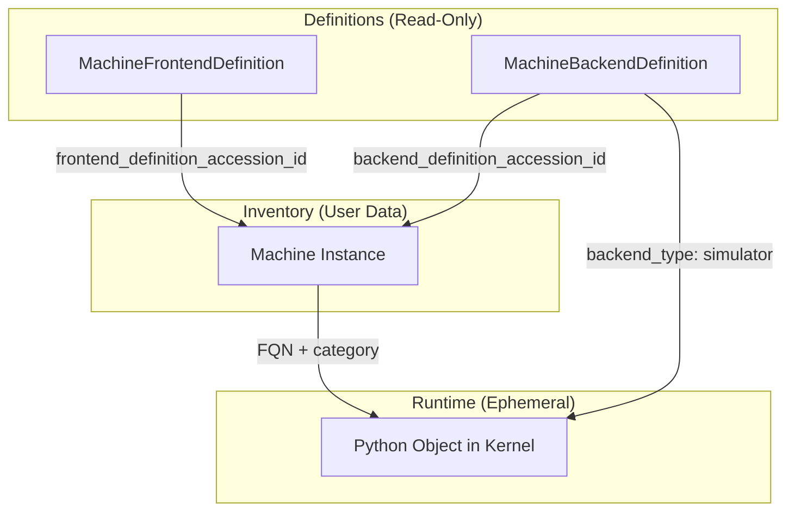
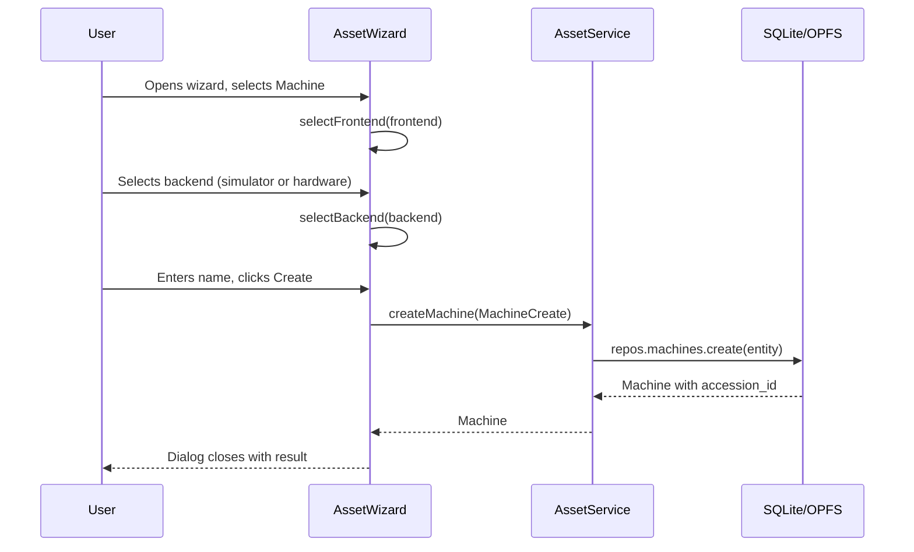
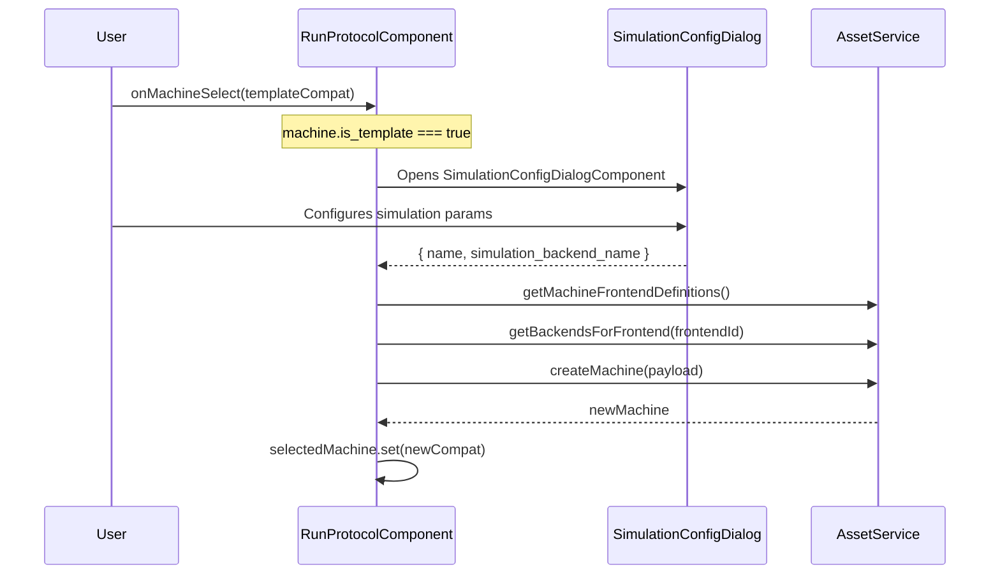
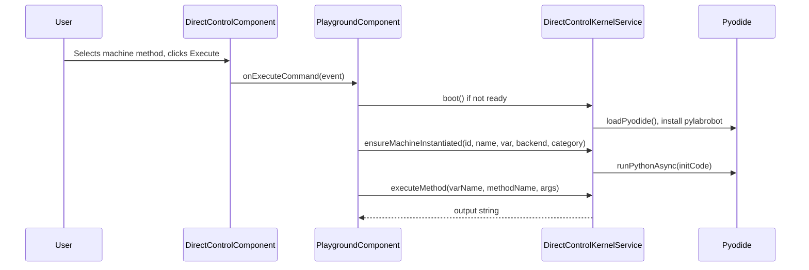
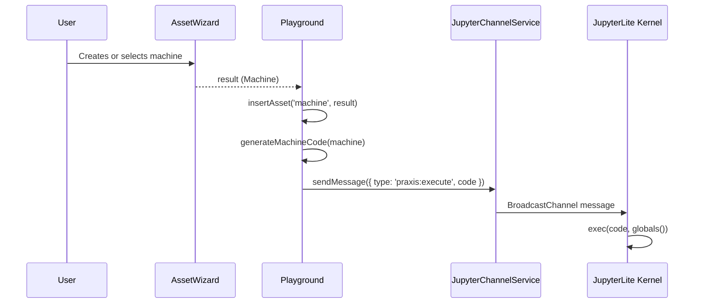

# Simulated Machine Instantiation Recon Report

## Executive Summary

There are **4 distinct pathways** to instantiate a simulated machine in the Praxis frontend:

| # | Pathway | Context | Entry Point |
|---|---------|---------|-------------|
| 1 | **Asset Wizard** | Inventory creation | `AssetWizard.createAsset()` |
| 2 | **Protocol Run Template** | On-the-fly at protocol start | `RunProtocolComponent.configureSimulationTemplate()` |
| 3 | **Direct Control** | Pyodide kernel instantiation | `DirectControlKernelService.ensureMachineInstantiated()` |
| 4 | **JupyterLite Injection** | REPL code execution | `PlaygroundComponent.insertAsset()` |

---

## Architecture Overview

### 3-Tier Machine Definition Architecture



### Key Data Models

| Model | Location | Purpose |
|-------|----------|---------|
| `MachineFrontendDefinition` | [asset.models.ts](file:///Users/mar/Projects/praxis/praxis/web-client/src/app/features/assets/models/asset.models.ts#L143-154) | PLR frontend class (e.g., `PlateReader`, `LiquidHandler`) |
| `MachineBackendDefinition` | [asset.models.ts](file:///Users/mar/Projects/praxis/praxis/web-client/src/app/features/assets/models/asset.models.ts#L156-167) | PLR backend class with `backend_type` field |
| `Machine` | [asset.models.ts](file:///Users/mar/Projects/praxis/praxis/web-client/src/app/features/assets/models/asset.models.ts#L55-81) | User inventory instance linking definitions |
| `MachineCreate` | [asset.models.ts](file:///Users/mar/Projects/praxis/praxis/web-client/src/app/features/assets/models/asset.models.ts#L83-103) | Payload for creating new machines |

### Simulation Detection

A machine is considered **simulated** when any of:
- `backend_definition.backend_type === 'simulator'`
- `is_simulation_override === true`
- `simulation_backend_name` is set
- `connection_info.backend` contains `'Simulator'`, `'simulation'`, or `'Chatterbox'`

---

## Pathway 1: Asset Wizard (Inventory Creation)

**File:** [asset-wizard.ts](file:///Users/mar/Projects/praxis/praxis/web-client/src/app/shared/components/asset-wizard/asset-wizard.ts)

### Flow



### Key Code

```typescript
// AssetWizard.createAsset() - lines 291-342
const machinePayload: MachineCreate = {
  name: config.name,
  machine_category: category,
  frontend_definition_accession_id: this.selectedFrontend?.accession_id,
  backend_definition_accession_id: this.selectedBackend?.accession_id,
  is_simulation_override: this.selectedBackend?.backend_type === 'simulator',
  simulation_backend_name: this.selectedBackend?.backend_type === 'simulator'
    ? this.getBackendDisplayName(this.selectedBackend!)
    : undefined,
};
createdAsset = await firstValueFrom(this.assetService.createMachine(machinePayload));
```

### Simulation Backend Selection

The wizard presents **backend options per frontend** via `AssetService.getBackendsForFrontend(frontendId)`. Backends with `backend_type === 'simulator'` show a distinct badge.

---

## Pathway 2: Protocol Run Template (On-the-fly Creation)

**File:** [run-protocol.component.ts](file:///Users/mar/Projects/praxis/praxis/web-client/src/app/features/run-protocol/run-protocol.component.ts)

### Flow

When user selects a "template" machine (not an existing inventory machine), the system creates an ephemeral machine:



### Key Code

```typescript
// RunProtocolComponent.configureSimulationTemplate() - lines 1181-1287
return this.assetService.createMachine({
  name: result.name,
  frontend_definition_accession_id: ids.frontendId,
  backend_definition_accession_id: ids.backendId,
  is_simulation_override: true,
  simulation_backend_name: result.simulation_backend_name,
  connection_info: {
    backend: result.simulation_backend_name,
    plr_backend: def.fqn || ''
  }
} as any);
```

---

## Pathway 3: Direct Control Pyodide Kernel

**File:** [direct-control-kernel.service.ts](file:///Users/mar/Projects/praxis/praxis/web-client/src/app/features/playground/services/direct-control-kernel.service.ts)

### Flow

The Direct Control tab uses a **dedicated Pyodide kernel** (separate from JupyterLite) for instant command execution:



### Python Code Generation

```typescript
// DirectControlKernelService.ensureMachineInstantiated() - lines 259-328
const frontendMap: Record<string, { module: string; cls: string }> = {
  'PlateReader': { module: 'pylabrobot.plate_reading', cls: 'PlateReader' },
  'LiquidHandler': { module: 'pylabrobot.liquid_handling', cls: 'LiquidHandler' },
  'Shaker': { module: 'pylabrobot.shaking', cls: 'Shaker' },
  // ...
};

const initCode = `
from ${backendModule} import ${backendClass}
from ${frontend.module} import ${frontend.cls}

${varName} = ${frontend.cls}(${frontendArgs})
`;
```

### Key Details

- Backend FQN is split to extract module path and class name
- Category-specific constructor args (e.g., `PlateReader` needs `size_x`, `size_y`, `size_z`)
- Machine ID → varName mapping cached in `instantiatedMachines: Map<string, string>`

---

## Pathway 4: JupyterLite REPL Injection

**File:** [playground.component.ts](file:///Users/mar/Projects/praxis/praxis/web-client/src/app/features/playground/playground.component.ts)

### Flow

From the Inventory panel, users can insert machine/resource variables into the JupyterLite notebook:



### Generated Machine Code

```python
# Machine: CLARIOstar 4B3F
from web_bridge import create_configured_backend
from pylabrobot.plate_reading import PlateReader

config = {
  "backend_fqn": "pylabrobot.plate_reading.clario_star_backend.CLARIOstarBackend",
  "port_id": "",
  "is_simulated": false,
  "baudrate": 9600
}
backend = create_configured_backend(config)
clariostar_4b3f = PlateReader(backend=backend)
await clariostar_4b3f.setup()
```

### Bootstrap Initialization

**File:** [playground-jupyterlite.service.ts](file:///Users/mar/Projects/praxis/praxis/web-client/src/app/features/playground/services/playground-jupyterlite.service.ts#L224-352)

The JupyterLite kernel is bootstrapped with:
1. `micropip.install()` of local pylabrobot wheel
2. Mocking of native dependencies (`pylibftdi`, `usb`, `serial`)
3. Loading WebSerial/WebUSB/WebFTDI shims
4. Patching `pylabrobot.io` modules
5. Setting up BroadcastChannel listener for `praxis:execute` messages

---

## Summary Table

| Aspect | Asset Wizard | Protocol Template | Direct Control | JupyterLite |
|--------|--------------|-------------------|----------------|-------------|
| **Persists to DB** | ✅ Yes | ✅ Yes | ❌ No | ❌ No |
| **Python Kernel** | None | None | Pyodide (dedicated) | JupyterLite |
| **FQN Resolution** | Frontend + Backend definitions | Frontend + Backend definitions | `frontendMap` + backend FQN | `web_bridge` helper |
| **Instantiation** | DB record only | DB record | Python object | Python object |
| **Use Case** | Inventory management | Protocol execution | Quick testing | Interactive development |

---

## Relevant Files

| Component | Path |
|-----------|------|
| Asset Wizard | [asset-wizard.ts](file:///Users/mar/Projects/praxis/praxis/web-client/src/app/shared/components/asset-wizard/asset-wizard.ts) |
| Asset Service | [asset.service.ts](file:///Users/mar/Projects/praxis/praxis/web-client/src/app/features/assets/services/asset.service.ts) |
| Asset Models | [asset.models.ts](file:///Users/mar/Projects/praxis/praxis/web-client/src/app/features/assets/models/asset.models.ts) |
| Run Protocol | [run-protocol.component.ts](file:///Users/mar/Projects/praxis/praxis/web-client/src/app/features/run-protocol/run-protocol.component.ts) |
| Playground | [playground.component.ts](file:///Users/mar/Projects/praxis/praxis/web-client/src/app/features/playground/playground.component.ts) |
| Direct Control Kernel | [direct-control-kernel.service.ts](file:///Users/mar/Projects/praxis/praxis/web-client/src/app/features/playground/services/direct-control-kernel.service.ts) |
| JupyterLite Service | [playground-jupyterlite.service.ts](file:///Users/mar/Projects/praxis/praxis/web-client/src/app/features/playground/services/playground-jupyterlite.service.ts) |
| Simulation Architecture | [simulation.md](file:///Users/mar/Projects/praxis/praxis/web-client/src/assets/docs/architecture/simulation.md) |
| Machine Argument Selector | [machine-argument-selector.component.ts](file:///Users/mar/Projects/praxis/praxis/web-client/src/app/shared/components/machine-argument-selector/machine-argument-selector.component.ts) |

---

## Follow-up Clarifications

### Q1: Does protocol execution use web_bridge and shims?

**Yes!** Protocol execution uses `web_bridge` and shims via [python.worker.ts](file:///Users/mar/Projects/praxis/praxis/web-client/src/app/core/workers/python.worker.ts).

The `EXECUTE_BLOB` case (lines 205-278) handles cloudpickle blob execution:

```python
from web_bridge import create_configured_backend, create_browser_deck

# Load function from bytes
protocol_bytes = bytes(js.protocol_bytes)
protocol_func = cloudpickle.loads(protocol_bytes)

if 'backend' in sig.parameters:
    kwargs['backend'] = create_configured_backend(config_proxy)
```

The worker also initializes all shims during boot ([initializePyodide](file:///Users/mar/Projects/praxis/praxis/web-client/src/app/core/workers/python.worker.ts#L302-442)):
- Loads `web_bridge.py`, `web_serial_shim.py`, `web_usb_shim.py`, `web_ftdi_shim.py`, `web_hid_shim.py`
- Patches `pylabrobot.io` modules via `web_bridge.bootstrap_playground()`
- Adds WebSerial/WebUSB/WebFTDI/WebHID to builtins

Additionally, `buildProtocolExecutionCode()` (lines 336-416 in [execution.service.ts](file:///Users/mar/Projects/praxis/praxis/web-client/src/app/features/run-protocol/services/execution.service.ts#L336-416)) generates Python that uses:
```python
from web_bridge import resolve_parameters, patch_state_emission, patch_function_call_logging
```

---

### Q2: Backend Type Values - what are the options?

There are **3 canonical values** for `backend_type`:

| Value | Usage | Example |
|-------|-------|---------|
| `'hardware'` | Physical device drivers | `pylabrobot.liquid_handling.backends.hamilton.STAR` |
| `'simulator'` | Simulation/chatterbox backends | `praxis.simulated.LiquidHandler` |
| `'mock'` | Testing mocks (rarely used) | (for unit tests) |

**Source of truth:**

1. **TypeScript models** ([asset.models.ts:140](file:///Users/mar/Projects/praxis/praxis/web-client/src/app/features/assets/models/asset.models.ts#L140), [L161](file:///Users/mar/Projects/praxis/praxis/web-client/src/app/features/assets/models/asset.models.ts#L161)):
   ```typescript
   backend_type?: 'hardware' | 'simulator' | 'mock';
   ```

2. **DB Schema** ([schema.ts:234](file:///Users/mar/Projects/praxis/praxis/web-client/src/app/core/db/schema.ts#L234)):
   ```typescript
   backend_type: BackendType | null;  // enum imported from ./enums
   ```

3. **Seed data** ([plr-definitions.ts:53](file:///Users/mar/Projects/praxis/praxis/web-client/src/assets/browser-data/plr-definitions.ts#L53)):
   ```typescript
   backend_type: 'hardware' | 'simulator';  // Only 2 used in seed data
   ```

**Detection logic** in seed data (line 249):
```typescript
backend_type: (m.fqn.includes('Chatterbox') || m.fqn.includes('praxis.simulated')) ? 'simulator' : 'hardware'
```

> [!NOTE]
> The seed data only uses 2 values (`hardware`/`simulator`), but the schema supports 3. The `mock` type exists for testing scenarios.

---

### Q3: Ephemeral Machine UX - What does the user see?

The machine selection UX is handled by [MachineArgumentSelectorComponent](file:///Users/mar/Projects/praxis/praxis/web-client/src/app/shared/components/machine-argument-selector/machine-argument-selector.component.ts).

#### What Users See

For each machine argument in a protocol, users see an expansion panel with **2 sections**:

```
┌─────────────────────────────────────────────────────┐
│ ◯ Liquid Handler                                    │
│   LiquidHandler                                     │
├─────────────────────────────────────────────────────┤
│ 📦 Existing Machines                                │
│ ┌──────────────────┐ ┌──────────────────┐           │
│ │ Hamilton STAR    │ │ OT-2 Lab         │           │
│ │ LiquidHandler    │ │ LiquidHandler    │           │
│ │           [Real] │ │           [Sim]  │           │
│ └──────────────────┘ └──────────────────┘           │
│                                                     │
│ ➕ Simulation Backends (or "Hardware Drivers")      │
│ ┌──────────────────┐ ┌──────────────────┐           │
│ │ 🧪 Chatterbox    │ │ 🔌 Hamilton STAR │           │
│ │ PyLabRobot       │ │ Hamilton         │           │
│ │           [Sim]  │ │       [Hardware] │           │
│ └──────────────────┘ └──────────────────┘           │
└─────────────────────────────────────────────────────┘
```

- **Section header changes** based on `simulationMode` toggle: "Simulation Backends" vs "Hardware Drivers"
- Cards show compatibility badges (Sim/Real) and grayscale incompatible options

#### Selection Logic

| User Selects | What Happens | Data Structure |
|--------------|--------------|----------------|
| **Existing Machine** | Uses inventory machine directly | `selection.selectedMachine = Machine` |
| **Backend** | Creates ephemeral machine on-the-fly | `selection.selectedBackend = MachineBackendDefinition` |

The selection is emitted via `MachineArgumentSelection`:
```typescript
interface MachineArgumentSelection {
  argumentId: string;        // Asset requirement accession_id
  argumentName: string;      // Display name
  frontendId: string;        // Frontend definition accession_id
  selectedMachine?: Machine; // IF selecting existing inventory
  selectedBackend?: MachineBackendDefinition; // IF selecting backend (ephemeral)
  isValid: boolean;
}
```

#### Mode Compatibility

The component enforces mode compatibility ([lines 779-787](file:///Users/mar/Projects/praxis/praxis/web-client/src/app/shared/components/machine-argument-selector/machine-argument-selector.component.ts#L779-787)):

```typescript
isMachineCompatible(machine: Machine): boolean {
  const isSimulated = machine.is_simulation_override || false;
  return this.simulationMode ? isSimulated : !isSimulated;
}

isBackendCompatible(backend: MachineBackendDefinition): boolean {
  const isSimulator = backend.backend_type === 'simulator';
  return this.simulationMode ? isSimulator : !isSimulator;
}
```

Incompatible options show grayed-out with "Mismatch" tooltip.

#### Data Flow Validation ✅

The logic **is consistent** with the underlying data structures:

1. **`MachineBackendDefinition.backend_type`** → matches `'simulator' | 'hardware'` check
2. **`Machine.is_simulation_override`** → boolean flag set during creation
3. **`MachineFrontendDefinition.accession_id`** → linked via `frontend_definition_accession_id` FK
4. **Selection state** properly propagates through `@Output() selectionsChange`

When a backend is selected (ephemeral case), the `RunProtocolComponent.startRun()` method ([line 1402](file:///Users/mar/Projects/praxis/praxis/web-client/src/app/features/run-protocol/run-protocol.component.ts#L1402)) packages it as:
```typescript
is_simulated: sel.selectedBackend.backend_type === 'simulator'
```
